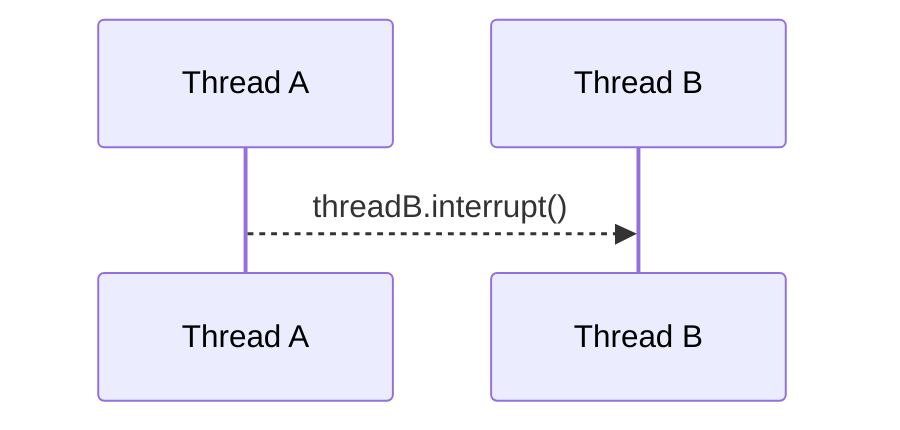

# Thread Coordination

## Thread Termination

Thread termination can be performed by using `Thread.interrupt()` method or by using **Daemon threads**.

### Thread Termination - Why and When?

- Threads consume resources.
  - Memory and kernel resources.
  - CPU cycles and cache memory.
- If a thread finished its work, but the application is still running, we want to cleanup the thread's resources.
- If a thread is misbehaving, we want to stop it.
- By default, the application will not stop as long as at least one thread is still running. So if we want to stop the application, we need
  to terminate all the threads.

### Thread.interrupt()



#### When can we interrupt a thread?

- If the thread is executing a method that throws `InterruptedException`.
- If the thread's code is handling the interrupt signal explicitly.

## Daemon Threads

Background threads that do not prevent the application from exiting if the main thread terminates.

### Daemon Threads - Scenario 1

- Background tasks that should not block our application from terminating.
  - Example: File saving thread in a Text Editor

### Daemon Threads - Scenario 2

- Code in a worker thread is not under our control, and we do not want it to block our application from terminating.
  - Example: Worker thread that uses an external library

If the external library doesn't handle thread interruption gracefully, we can set `thread.setDaemon(true)`.

```java
import java.math.BigInteger;

public class Main {
  public static void main(String[] args) {
    Thread thread = new Thread(new LongComputationalTask(new BigInteger("2000000"), new BigInteger("10000000")));
    thread.setDaemon(true);
    thread.start();
    Thread.sleep(100);
    thread.interrupt();
  }

  private static class LongComputationalTask implements Runnable {

    private final BigInteger base;
    private final BigInteger power;

    private LongComputationalTask(BigInteger base, BigInteger power) {
      this.base = base;
      this.power = power;
    }

    @Override
    public void run() {
      System.out.println(base + "^" + power + " = " + pow(base, power));
    }

    private BigInteger pow(BigInteger base, BigInteger power) {
      BigInteger result = BigInteger.ONE;
      for (BigInteger i = BigInteger.ZERO; i.compareTo(power) != 0; i=i.add(BigInteger.ONE)) {
        result = result.multiply(base);
      }
      return result;
    }
  }
}
```

### Summary about thread termination and daemon threads

- If the method does not respond to the interrupt signal by throwing the `InterruptedException`, we need to check for that signal and handle it ourselves.
- To prevent a thread from blocking our app from exiting, we set the thread to be a Daemon thread.
