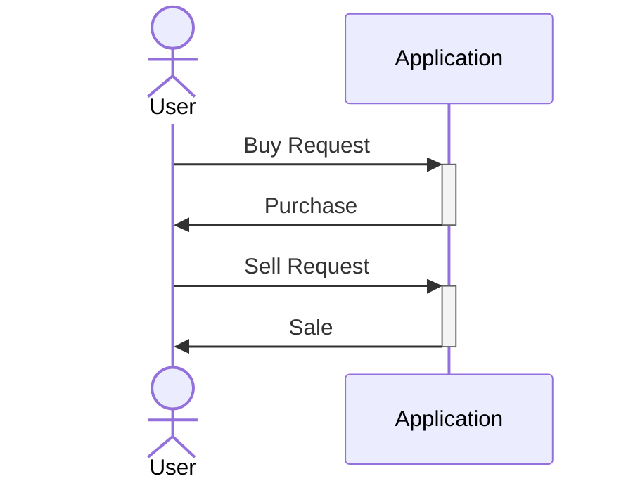
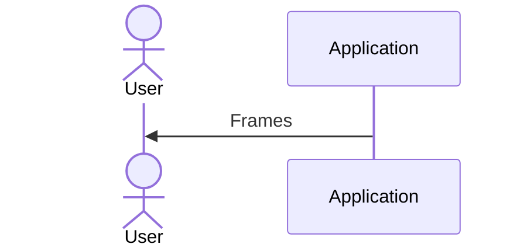
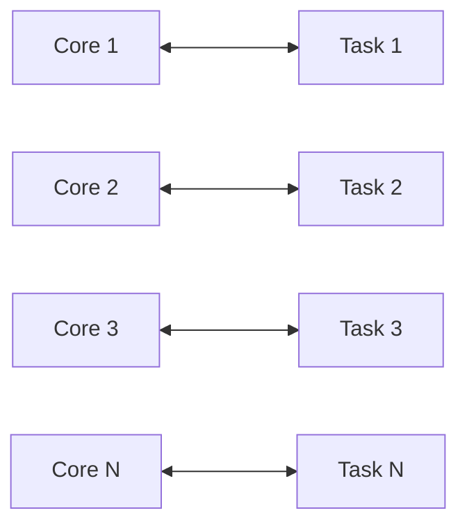
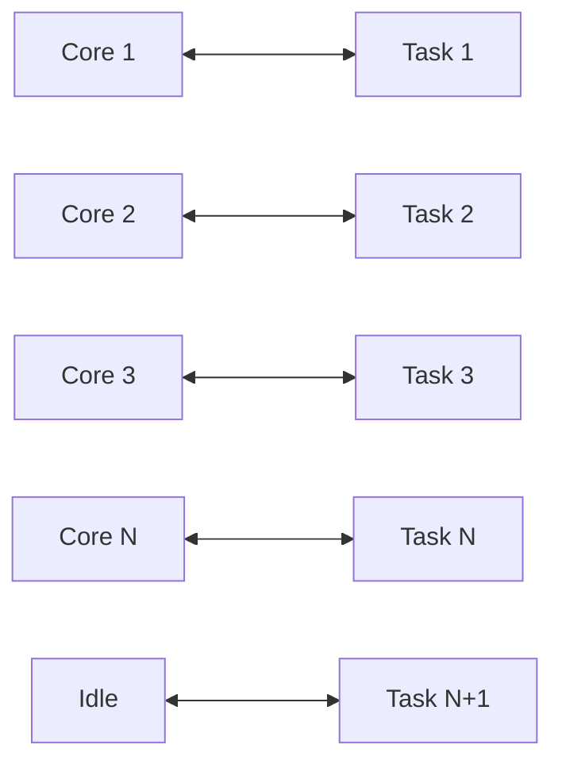
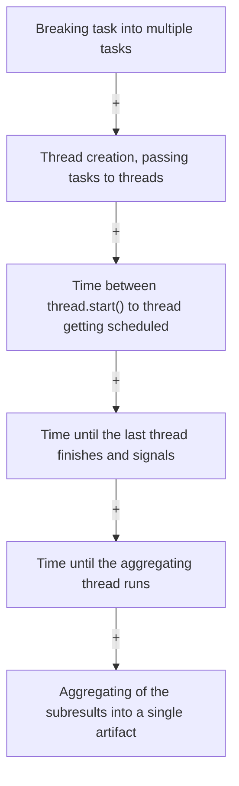
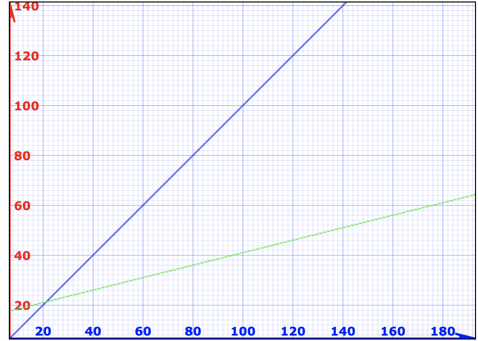

# Performance Optimization

In different scenarios and use cases, performance can be measured entirely differently.

### Example 1: High Speed Trading System



- Latency is the most important element of performance in a high speed trading system.

- The faster the transaction is, the more performant the system is considered.

- Latency is measured in unit of time.

### Example 2: Video Player



- If the video player application tries to deliver all frames as fast as possible, it will lead to a terrible experience.

- If a movie is recorded in 30fps and video player tries to show it at 1000 fps, we won't be able to see anything.

- The performance metrics for a video player are precision and accuracy of the frame rate.

### Example 3: Machine Learning

- The system running machine learning algorithm should have the ability to take in huge amount of data to process.
- So throughput is the performance metric in this case.

## Performance in multithreading

In general, we are concerned about two important performance metrics:
- **Latency**: The time to completion of a task. Measured in time units.
- **Throughput**: The amount of tasks completed in a given period. Measured in tasks/time unit.

They are completely different metrics and improving one may have absolutely no impact on the other.

## How can we improve Latency using multithreading

- Let's say we have a task which takes T time to complete if ran in a single thread.

- We can break the given task into N different tasks: `Task1`, `Task2`, `Task3`,..., `TaskN`

- Then, we schedule those tasks to run on different threads. Theoretically, we want to achieve a latency of `T/N`.

- Theoretical reduction of latency by N = Performance improvement by a factor of N

**Is it possible to achieve this theoretical reduction in latency? We need to answer a few questions:**

- N = ?
  - How many subtasks/threads to break the original task?
- Does breaking original task and aggregating results come for free?
- Can we break any task into subtasks?

### 1. N = ?

- On a general purpose computer, N = number of cores (N should be as close to number of cores as possible)
- Operating system will do the best to schedule every task on different core.



- Adding an extra thread will be counter-productive and will increase the latency. That additional thread will keep pushing the other threads out of their core
  leading to context switches, bad cache performance and extra memory consumption.



#### Notes:

- Number of threads = Number of cores is optimal only if all threads are runnable and can run without interruption (no I/O blocking calls / sleep etc).
- The assumption is nothing else is running that consumes a lot of CPU.
- **Hyperthreading (Virtual Cores Vs Physical Cores)**: Most computers today use hyperthreading. Some hardware units are duplicated inside a single core so that two separate threads can run in parallel. Some hardware units are shared.

### 2. Does breaking original task and aggregating results come for free? (Inherent cost of parallelization and Aggregation)

Total Cost can be calculated as:



**Latency Vs Original Task Latency**

```
Blue - Single Threaded solution, Green - Multithreaded solution
X-axis - N
Y-axis - Latency
```



The key takeaway from this graph is that small and trivial tasks are not worth breaking into multiple subtasks and running in multithreaded fashion.

### 3. Can we break any task into subtasks?

The answer is "No".

Tasks are generally of three types:

- Type 1. Parallelizable Tasks
- Type 2. Unbreakable, Sequential Tasks
- Type 3. Partially parallelizable, Partially Sequential

## Summary

- Performance can be defined in many ways depending on the use case.
- Multithreaded applications performance criteria:
  - Latency
  - Throughput
- Latency reduction by breaking the task into multiple subtasks and running in parallel.
